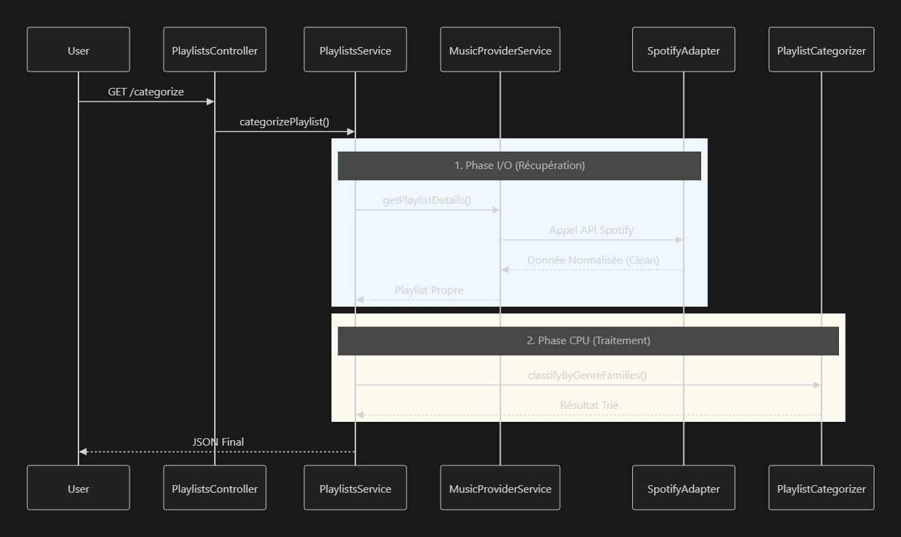
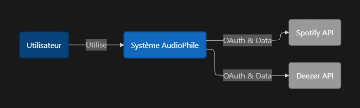
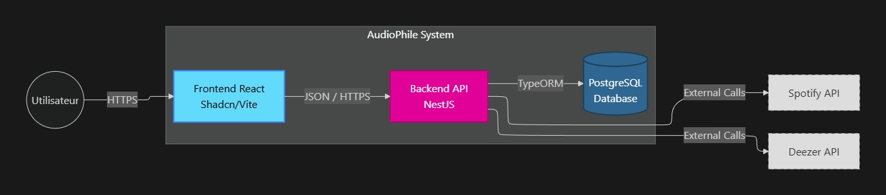
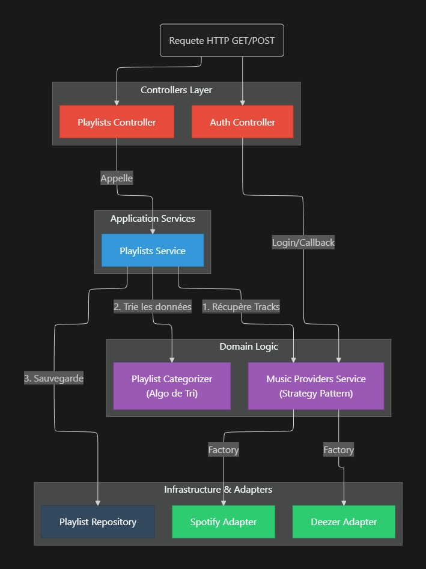
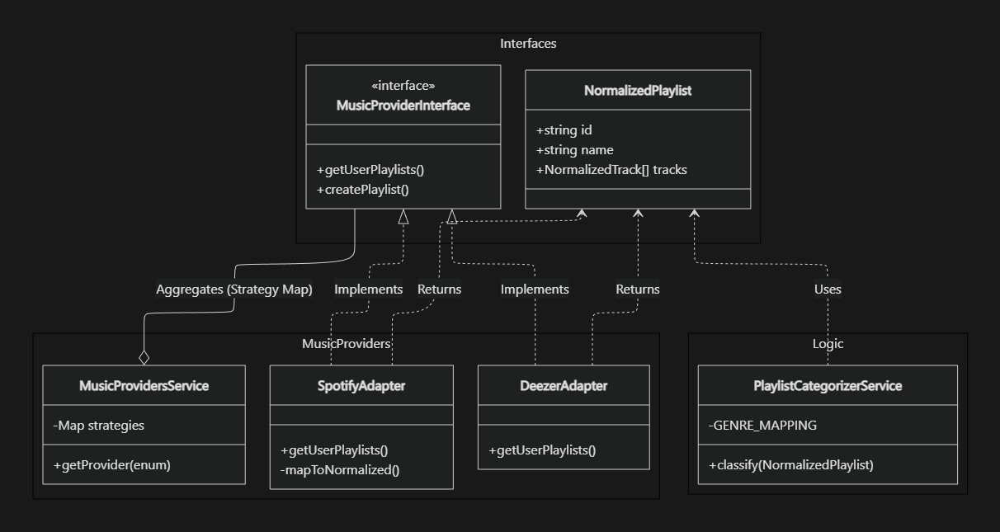

# A. Architecture & Design Patterns - Projet Audiophile:

## 1. Vue d'ensemble

Nous avons refusé l'architecture "standard" de NestJS (tout à plat) pour isoler le **Cœur du métier** (le tri) des **Détails techniques** (les API externes).

- **Avantage clé :** Si l'API Spotify change demain, ou si on ajoute Apple Music, la logique de tri ne bouge pas.

---

## 2. Les Design Patterns implémentés

### A. Le Pattern ADAPTER

- **Fichier :** `src/modules/music-providers/adapters/spotify.adapter.ts`
- **Le Problème :** L'API Spotify renvoie un JSON complexe, imbriqué et "sale".
- **La Solution :** L'Adapter agit comme un traducteur universel. Il transforme la donnée Spotify en un objet propre `NormalizedPlaylist` que notre app comprend.
- **Pourquoi ?** Pour découpler notre application de Spotify. Le reste du code ne connait que l'interface `MusicProviderInterface`.

### 🔀 B. Le Pattern STRATEGY

- **Fichier :** `src/modules/music-providers/music-providers.service.ts`
- **Le Problème :** Gérer plusieurs fournisseurs (Spotify, Deezer...) sans faire des `if/else` géants.
- **La Solution :** On utilise une `Map` (Registre) pour associer une clé (`ProviderEnum`) à une implémentation. Le service agit comme un routeur.
- **Pourquoi ?** Respect du principe **Open/Closed**. Pour ajouter Deezer, on crée juste un fichier et on l'ajoute à la Map.

### C. Le DOMAIN SERVICE (Single Responsibility)

- **Fichier :** `src/modules/playlists/playlist-categorizer.service.ts`
- **Le Problème :** Le `PlaylistsService` mélangeait tout : appels réseaux (IO) et calculs de tri (CPU).
- **La Solution :** Extraction de la logique pure dans un `Categorizer`.
- **Pourquoi ?**
  1. **Performance :** On sépare l'attente réseau du travail processeur.
  2. **Testabilité :** On peut tester l'algo de tri sans internet et sans mocker Spotify.

---

## 3. Structure des dossiers

| Dossier                   | Rôle (Layer)         | Responsabilité                                                    |
| ------------------------- | -------------------- | ----------------------------------------------------------------- |
| `modules/music-providers` | **Infrastructure**   | Le tuyau vers l'extérieur. Contient les Adapters et l'Interface.  |
| `modules/playlists`       | **Domaine (Métier)** | Le cerveau. Orchestre les demandes et contient la logique de tri. |
| `common`                  | **Shared**           | Outils partagés (Config, DTOs globaux).                           |

---

## 4. Le Flux de Donnée (Data Flow)

Voici le trajet d'une requête "Catégoriser une playlist" :

---

---

# B. Types & Interfaces

## 1. Les Interfaces Externes (Music Provider)

_Ces interfaces normalisent les données venant de Spotify ou Deezer pour qu'elles aient la même forme dans notre application, peu importe la source._

### `NormalizedPlaylist`

C'est la représentation "propre" d'une playlist brute, avant tout traitement.

- **Fichier :** `src/modules/music-providers/interfaces/music-provider.interface.ts`
- **Usage :** Retourné par `SpotifyBrowser` ou `DeezerBrowser` vers le Service.

TypeScript

`export interface NormalizedPlaylist {
  id: string;       // ID original (ex: ID Spotify)
  name: string;     // Nom de la playlist
  provider: ProviderEnum; // 'spotify' | 'deezer'
  tracks: NormalizedTrack[]; // Liste des morceaux
}`

### `NormalizedTrack`

Représente un morceau de musique unique, nettoyé de toutes les données inutiles de l'API externe.

- **Fichier :** `src/modules/music-providers/interfaces/music-provider.interface.ts`
- **Usage :** Contenu dans `NormalizedPlaylist`.

TypeScript

`export interface NormalizedTrack {
  id: string;       // ID du morceau
  title: string;    // Titre
  artist: string;   // Nom de l'artiste principal
  album: string;    // Nom de l'album
  duration: number; // Durée en secondes
  genre?: string;   // Genre (Optionnel car pas toujours renvoyé par l'API)
}`

---

## 2. Les Interfaces Métier (Categorization)

_Ces interfaces définissent comment nous trions et organisons la musique._

### `CategorizedPlaylist` (Le Cœur du Tri )

C'est l'objet final qui contient la playlist triée par familles de genres. C'est la structure **Source de Vérité** de l'application.

- **Fichier :** `src/modules/playlists/interfaces/categorized-playlist.interface.ts`
- **Usage :**
  - Retourné par `PlaylistCategorizerService`.
  - Stocké dans la base de données (colonne JSONB).
  - Renvoyé au Frontend.

TypeScript

`// C'est un Dictionnaire : Clé = Nom de la Famille, Valeur = Liste de morceaux
export interface CategorizedPlaylist {
[categoryName: string]: TrackItem[];
}

// Exemple de structure :
// {
// "Rock & Metal": [ {id: "1", title: "Numb"...}, {id: "2", title: "In the End"...} ],
// "Electro": [ {id: "3", title: "Get Lucky"...} ]
// }`

### `TrackItem`

C'est la version "enrichie et stricte" d'un morceau une fois qu'il est entré dans notre système de tri. Contrairement à `NormalizedTrack`, ici le genre est obligatoire (ou mis à "Unknown").

- **Fichier :** `src/modules/playlists/interfaces/categorized-playlist.interface.ts`

TypeScript

`export interface TrackItem {
  id: string;
  title: string;
  artist: string;
  album: string;
  duration: number;
  genre: string; // Obligatoire ici (garanti par le service de tri)
}`

---

## 3. Les Entités Base de Données (TypeORM)

_La représentation des données stockées dans PostgreSQL._

### `Playlist` (Entity)

- **Fichier :** `src/modules/playlists/entities/playlist.entity.ts`
- **Point d'attention :** Notez l'utilisation de `import type` pour l'interface JSONB afin d'éviter les erreurs de dépendance circulaire au runtime.

TypeScript

`@Entity('playlists')
export class Playlist {
@PrimaryGeneratedColumn('uuid')
id: string;

@Column()
originalId: string; // ID Spotify/Deezer

// Stockage du résultat du tri au format JSON
// Utilise l'interface CategorizedPlaylist pour le typage TypeScript
@Column({ type: 'jsonb', nullable: true })
categorizedResult: CategorizedPlaylist;

// ... autres champs (user, dates, provider...)
}`

---

## 4. Les DTOs (Data Transfer Objects)

_Ces objets valident ce que le Frontend nous envoie._

### `ExportPlaylistDto`

Utilisé quand l'utilisateur veut créer la playlist sur son compte Spotify/Deezer.

- **Fichier :** `src/modules/playlists/dto/export-playlist.dto.ts`

TypeScript

`export class ExportPlaylistDto {
@IsString()
sourcePlaylistId: string; // L'ID original de la playlist source

@IsString()
categoryName: string; // La catégorie à exporter (ex: "Rock")

@IsOptional()
@IsArray()
trackIds?: string[]; // (Optionnel) Liste d'IDs si l'utilisateur a décoché des sons.
// Si présent : Met à jour la BDD avant l'export.

@IsOptional()
@IsString()
customName?: string; // (Optionnel) Nom personnalisé pour la nouvelle playlist
}`

---

## Résumé du Flux de Données

1. **Récupération :** `SpotifyBrowser` récupère des données `any` et les transforme en **`NormalizedPlaylist`**.
2. **Traitement :** `PlaylistCategorizerService` prend une `NormalizedPlaylist` et renvoie une **`CategorizedPlaylist`** (dictionnaire de `TrackItem`).
3. **Stockage :** `PlaylistsService` sauvegarde cet objet dans `Playlist.categorizedResult` (Base de Données).
4. **Export :** Le Controller reçoit un **`ExportPlaylistDto`**, le Service lit la BDD, filtre selon les besoins, et envoie les IDs à Spotify.

---

---

# C. Domaine Driven Design

## 1. Ubiquitous Langage:

**User :** Un individu qui veux trier et/ou analyser ses playlists et auteurs favoris

**Filtered Playlist:** Analyse des musiques et genres écouté par l’utilisateur pour en faire ressortir des genres thèmes dominants

**Filter Request :** L’utilisateur demande une analyse d’une playlist pour en extraire des informations

**Tracks Providers :** Site externe d’hébergement musical comme Spotify ou Youtube Music

**Tracks :** Composé d’une musique, d’un titre, d’un auteur(artiste), d’une date de création, d’une image, d’un album

**Artists :** Auteur de Tracks

**Playlists :** Liste de Tracks

## 2. **Bounded Contexts :**

Supervise l'authentification, l'inscription et les fonctionnalités des utilisateurs, notamment le stockage des données.

## 3. Entity and Value Object :

**User Entity:**  Représente un utilisateur enregistrer dans la plateforme, avec des donnés comme l’user ID, l’email, le password et les Tracks Provider connecté

**Filtered Playlist Value Object:** Représente un agrégat des genres et artistes les plus écoutés par l'utilisateur.

**Filter Request :** Représente la requête d'analyse d'un utilisateur, incluant des propriétés telles que l'identifiant de la requête, la liste de lecture et le résultat.

**Playlists Value Object:** Représente une liste de Tracks d’un utilisateur

**Track Value Object:** Ensemble des informations relatives à une seule musique

## Aggregate :

**Taste Aggregate** = User + Playlist + Analysis

## 4. Repository :

**Data Repository :** Fournit des méthodes pour interroger et stocker les entités liées aux Tracks, Playlist et User.

## 5. **Domain Events**

**FilterRequestedEvent : Déclenché lorsqu'un utilisateur demande une analyse, contenant des détails sur la demande d'analyse et l'identifiant de l'utilisateur**

## 6. **Example** Scenario :

**User Requesting an Analysis :** Un utilisateur choisit une liste de lecture à analyser, déclenchant l'événement AnalysisRequestedEvent.

**Filter in Progress :** Le site Web indique que l'analyse est « en cours ».

**Filter Completion :** L'analyse est terminée et les données sont affichées.

---

---

# Diagram C1 à C4

